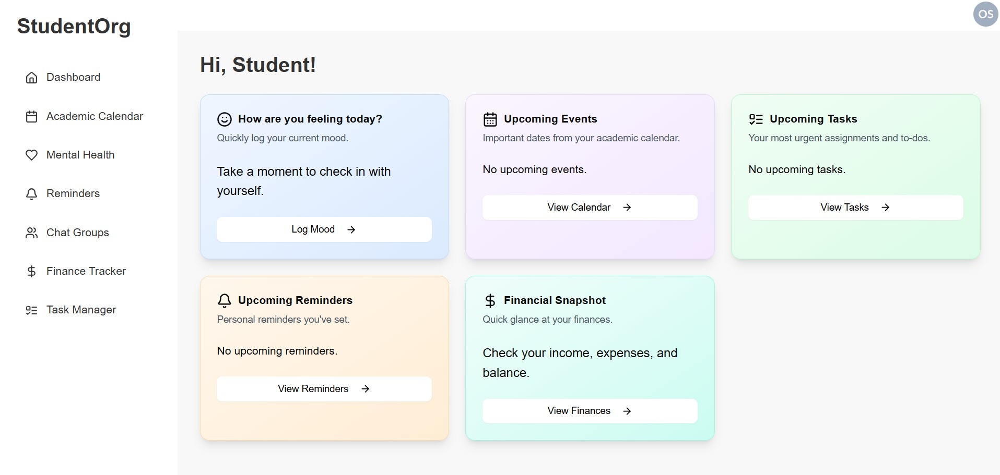
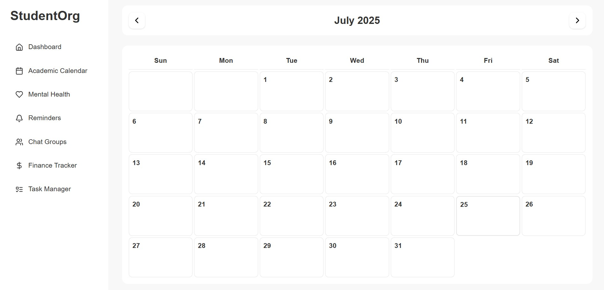
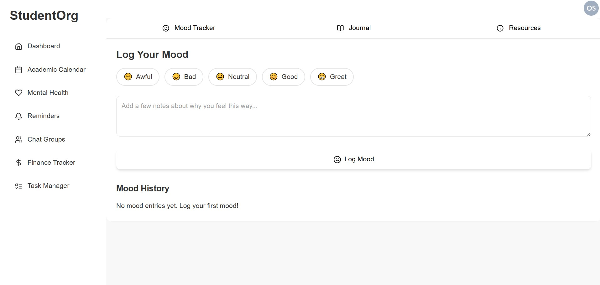
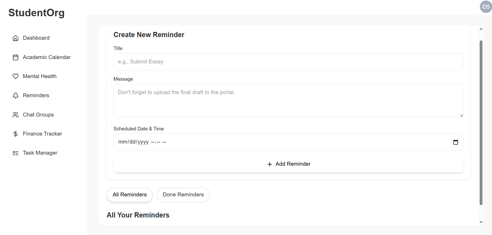
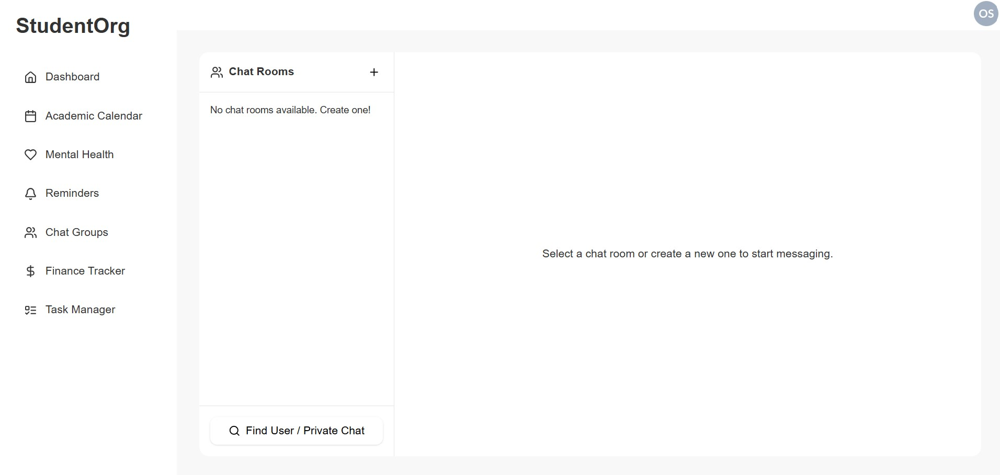
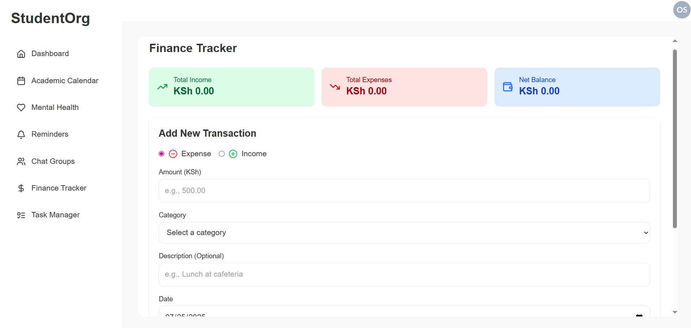
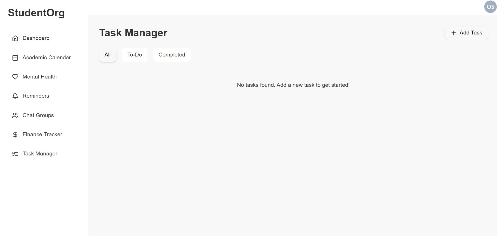

# 🎓 StudentOrg — Your All-in-One Academic Companion

> A full-stack academic productivity platform designed to help students organize, connect, and thrive.

---

## 📖 Table of Contents
1.  [Project Description](#project-description)
2.  [Features](#features)
3.  [System Architecture](#system-architecture)
4.  [Deployed Application](#deployed-application)
5.  [Video Demonstration](#video-demonstration)
6.  [Screenshots](#screenshots)
7.  [Technologies Used](#technologies-used)
8.  [Setup and Installation](#setup-and-installation)
    * [Prerequisites](#prerequisites)
    * [Firebase Project Setup](#firebase-project-setup)
    * [Backend Setup](#backend-setup)
    * [Frontend Setup](#frontend-setup)
9.  [Running the Application Locally](#running-the-application-locally)
10.  [Testing](#testing)
11. [Deployment (Render)](#deployment-render)

---

## 1. 🧩 Project Description

**StudentOrg** is a comprehensive, full-stack web application designed to empower students by centralizing their academic, personal, and financial management.  

Built with the **MERN stack** (Firebase, Express.js, React, Node.js) and leveraging **Google Cloud Firestore**, it provides a seamless platform to organize tasks, track academic progress, manage finances, maintain mental well-being, and connect with peers.

The goal: reduce student stress and improve productivity through an integrated suite of tools for student life.

---

## 2. ✨ Features

* **User Authentication:** Secure signup and login powered by Firebase Authentication.
* **Personalized Dashboard:** Overview of upcoming events, tasks, and reminders, and mood tracking.
* **Academic Calendar:** Manage academic events and deadlines with an intuitive calendar.
* **Task Manager:** Track, prioritize and complete academic and personal tasks.
* **Chat Groups:** Real-time group chats for collaboration and peer communication.
* **Mental Health Tracker:** Log moods, write journals, and access curated wellness resources (with a focus on Kenya-specific support).
* **Finance Tracker:** Track income and expenses, categorize transactions, and gain insights.
* **Reminders:** Create personalized reminders for important tasks and events.

---

## 3. 🏗 System Architecture

StudentOrg follows a modular full-stack architecture:

- **Frontend (React + Vite):** Handles UI, routing, and API interactions.  
- **Backend (Node.js + Express):** Exposes REST APIs and WebSocket endpoints.  
- **Database (Firestore):** Stores user data, messages, and app content.  
- **Authentication (Firebase Auth):** Secures users and manages sessions.  
- **Deployment:** Hosted on **Render** (backend and frontend).

---

## 4. 🌍 Deployed Application

Experience StudentOrg live!

**Frontend:** [https://student-org-app.vercel.app](https://student-org-app.vercel.app)  
**Backend:** [https://student-org-1.onrender.com](https://student-org-1.onrender.com)

---

## 5. 🎥 Video Demonstration

Watch a video demonstration showcasing the key features and user flows of StudentOrg:

[/]

---

## 6. 🖼 Screenshots

Here are some screenshots highlighting key features of StudentOrg:

### Dashboard

*A personalized overview of your day with upcoming events, tasks, and mood check-ins.*

### Academic Calendar

*Visualize academic deadlines and personal events.*

### Mental Health Tracker

*Track moods, write journals, and access mental wellness resources.*

### Reminders

*Set personalized reminders.*

### Chat Groups

*Real-time group communication for projects and study sessions.*

### Finance Tracker

*Monitor your income and expenses.*

### Task Manager

*Organize and track your academic and personal to-dos.*

---

## 7. 🧰 Technologies Used

### **Backend (Node.js / Express.js)**
- Runtime: **Node.js**  
- Framework: **Express.js**  
- Database Interaction: **Firebase Admin SDK** (Firestore, Auth)  
- Environment Variables: **dotenv**  
- CORS: **cors**  
- Testing: **Jest**, **Supertest**, **Babel**

### **Frontend (React.js / Vite)**
- Framework: **React.js**
- Build Tool: **Vite**
- Styling: **Tailwind CSS**
- UI Components: **Shadcn UI (Radix UI)**
- Icons: **Lucide React**
- Routing: **React Router DOM**
- HTTP Client: **Axios**
- Dates: **date-fns**
- Notifications: **react-hot-toast**
- Charts: **Recharts**
- Testing: **Vitest**, **React Testing Library**

### **Database**
- **Google Cloud Firestore** — flexible, NoSQL cloud database.

### **Authentication**
- **Firebase Authentication** — secure user management.

---

## 8. ⚙️ Setup and Installation

### Prerequisites
- **Node.js:** v18+ (LTS recommended).
- **pnpm** (Preferred) or npm/yarn.
    ```bash
    npm install -g pnpm
    ```

* **Firebase Project:**
    * Create one in the [Firebase Console](https://console.firebase.google.com/).
    * Enable **Firestore Database** and **Authentication**
    * **Generate a service account key:**
        * Go to Project settings -> Service accounts.


### Firebase Project Setup

1.  **Firestore Rules Example**
    
    ```firestore
    rules_version = '2';
    service cloud.firestore {
      match /databases/{database}/documents {
        match /artifacts/{appId}/public/data/{collection}/{document} {
          allow read, write: if request.auth != null;
        }
        match /artifacts/{appId}/users/{userId}/{collectionName}/{documentId} {
          allow read, write: if request.auth != null && request.auth.uid == userId;
        }
      }
    }
    ```

### Backend Setup

**Clone repository and install dependencies:**
    ```bash
    git clone [https://github.com/stacy-wk/STUDENT-ORG.git](https://github.com/stacy-wk/STUDENT-ORG.git)
    cd StudentOs/server
    pnpm install
    ```

**Create a `.env` file in the root directory:**
    ```env
    PORT=5000
    FIREBASE_PROJECT_ID=your-firebase-project-id
    VITE_API_BASE_URL=http://localhost:5000/api
    JWT_SECRET=your_super_secret_jwt_key
    GOOGLE_APPLICATION_CREDENTIALS=./server/config/your-service-account-key.json
    ```

    * Place your downloaded Firebase Admin SDK JSON file into `server/config/` and update the path accordingly.

### Frontend Setup

**Navigate to the client directory and install dependencies:**
    ```bash
    cd ../client
    pnpm install
    ```

**Create a `.env.local` in client/:**
   
    ```env
    VITE_FIREBASE_API_KEY="your_api_key"
    VITE_FIREBASE_AUTH_DOMAIN="your_auth_domain"
    VITE_FIREBASE_PROJECT_ID="your_project_id"
    VITE_FIREBASE_STORAGE_BUCKET="your_storage_bucket"
    VITE_FIREBASE_MESSAGING_SENDER_ID="your_messaging_sender_id"
    VITE_FIREBASE_APP_ID="your_app_id"
    VITE_FIREBASE_MEASUREMENT_ID="your_measurement_id"
    ```
---

## 9. 💻 Running the Application Locally

- **Start Backend:**
    
    ```bash
    cd server
    pnpm run dev
    ```
    Runs on `http://localhost:5000`.

- **Start Frontend:**
    
    ```bash
    cd client
    pnpm run dev
    ```
    Runs on `http://localhost:5173`

---

## 10. 🧪 Testing

* **Backend (Jest & Supertest):**

        ```bash
        cd server
        pnpm test
        ```
    
* **Frontend (Vitest & React Testing Library):**

        ```bash
        cd client
        pnpm test
        ```
 
    * Perform manual tests on multiple devices and browsers to ensure responsiveness and accessibility.

---

## 11. 🚀 Deployment (Render)

* **Backend Deployment**
    * Deploy `/server` as a Render Web Service.
    * Configure `pnpm install` as the build command and `pnpm start` as the start command.
    * Set environment variables:
     `GOOGLE_APPLICATION_CREDENTIALS_JSON` with the full JSON content.

* **Frontend Deployment**
    * Deploy `/client` as a Render Static Site.
    * Set `pnpm install && pnpm run build` as the build command and `dist` as the publish directory.
    * Set environment variables for `VITE_API_BASE_URL` and `VITE_FIREBASE_...` client configuration variables.


## Built with love by [Stacy Kamau](https://github.com/stacy-wk)
## Empowering students to stay organized, connected, and mentally healthy.